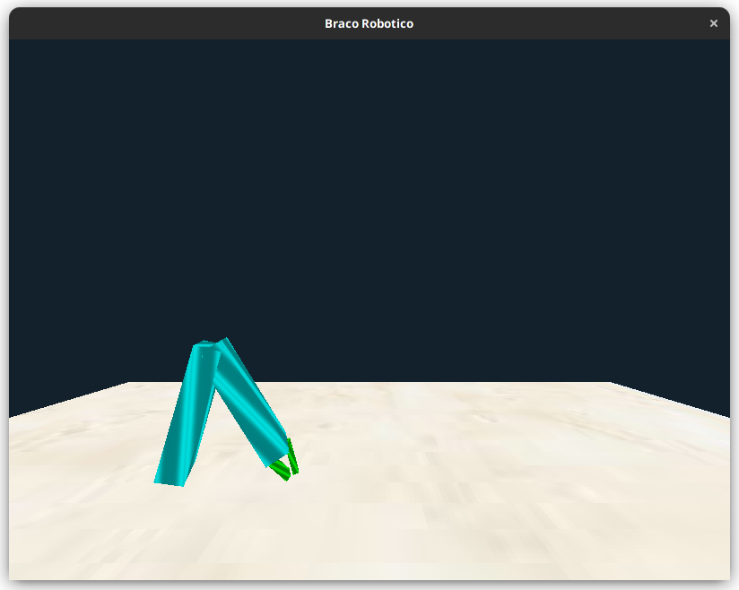

# Projeto Final

simulação de um braço robótico


## Execute os testes !!

```shell
python -m unittest discover  -v 
```

## Instale as dependências 
```shell
pip install -r requirements.txt
```

## Observações
Foi utilizado a versão __3.10__ do python 

## execução da aplicação:
```shell
python  src/main.py    
```

### Controle do braço

- A aumenta o angulo do ombro
- a diminui o angulo do ombro
- S aumenta o angulo do cotovelo
- s diminui o angulo do cotovelo
- B aumenta o angulo da base
- b diminui o angulo da base
- C abre a garra
- c fecha a garra 

Setinhas, esquerda, direita, frente e trás controla a visão da camera.


